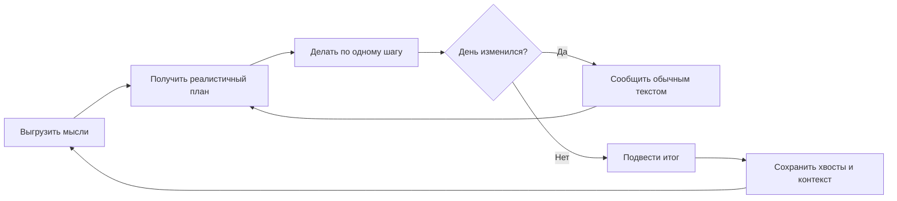
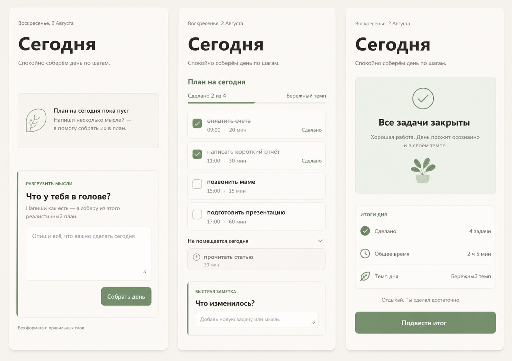

---
aliases:
  - Today Experience Concept
type: design-concept
status: proposed
area: design
updated: 2026-08-02
---

# Концепция Today Experience

## Коротко

AI Life Planner должен ощущаться не как список задач, а как **спокойная рабочая поверхность одного дня**. Пользователь выгружает мысли свободным текстом, получает выполнимый план, отмечает сделанное и сообщает об изменениях тем же естественным языком.

Главная дизайнерская идея: **один живой Today screen вместо набора разделов**. Утром экран помогает выгрузить мысли, днём — удерживать реалистичный фокус, вечером — мягко закрыть день. Состав блоков остаётся знакомым, но их приоритет меняется в зависимости от состояния дня.

## Продуктовая задача дизайна

Снять четыре вида нагрузки:

1. **Нагрузка входа:** не заставлять пользователя сначала создавать структуру.
2. **Нагрузка выбора:** ясно показывать следующий реалистичный шаг.
3. **Нагрузка изменений:** позволять сообщить новые обстоятельства без ручного пересобирания списка.
4. **Нагрузка незавершённости:** не превращать перенос и итог дня в чувство провала.

Дизайн успешен, если пользователь за 5–10 секунд понимает:

- что сейчас важнее всего;
- сколько задач реально помещается;
- что не потеряно, но не обещано на сегодня;
- куда написать, если день изменился.

## Опыт, который мы создаём

### 1. Тихий AI

AI проявляется результатом: собранным планом, понятным объяснением и корректной адаптацией. В основном интерфейсе нет «магических» градиентов, технических intent, чата ради чата и отдельного AI-персонажа.

### 2. Реалистичность важнее продуктивности

Главная метрика экрана — не размер backlog, а соответствие плана времени и энергии. Блок `not_scheduled` показывается честно и нейтрально: «Не помещается сегодня», а не «Просрочено» или «Не выполнено».

### 3. Одно действие в фокусе

В каждый момент экран предлагает одно основное действие:

- пустой день — выгрузить мысли;
- активный день — начать или отметить ближайшую задачу;
- изменившийся день — сообщить, что изменилось;
- завершённый день — выдохнуть или подвести итог.

### 4. Память без ощущения контроля

Цели, профиль и хвосты видимы, когда помогают принять решение, но не конкурируют с планом. Пользователь должен чувствовать, что система помнит контекст, а не наблюдает и оценивает его.

## Ментальная модель

## Информационная архитектура Today

Порядок блоков определяется текущей задачей пользователя, а не симметрией страницы.

| Зона | Роль | Правило показа |
|---|---|---|
| Контекст дня | Дата, «Сегодня», спокойная фраза-фокус | Всегда |
| Реалистичный план | Progress, energy, запланированные задачи | Всегда; empty state вместо пустого списка |
| Свободный ввод | Утренний brain dump или компактное «Что изменилось?» | Всегда доступен, визуальный приоритет зависит от состояния |
| Результат AI | Кратко объясняет, что изменилось | После обработки сообщения; не превращается в историю чата |
| Не помещается сегодня | Честно отделяет непоместившиеся задачи | Только при `not_scheduled` или задачах дня без слота |
| Позже | Задачи будущих дат | Только при полезном содержимом; ниже Today-контекста |
| Цели | Напоминают направление | Вторичный, сворачиваемый или контекстный блок |
| Локальные настройки | Dev-only идентификация и состояние backend | Только локальная сборка; отсутствует в production UX |

## Ритм одного дня

### Утро: снять неопределённость

Brain dump находится выше пустого плана или сразу после короткого empty state. Поле допускает длинную, неструктурированную мысль. После отправки фокус переходит к собранному плану, а подтверждение объясняет изменения.

### День: удержать следующий шаг

План становится главным блоком. Задачи показываются в порядке выполнения, с временем и длительностью там, где они известны. Полный brain dump превращается в компактный блок «Что изменилось?» — это тот же message pipeline, а не новая функция.

### Изменение обстоятельств: адаптировать без ручной перекладки

Пользователь пишет: «задержался до 20», «сил почти нет» или «появился срочный звонок». Во время обработки текущий план остаётся видимым. После ответа изменённые элементы подсвечиваются один раз, а непоместившиеся задачи отделяются от обещанного плана.

### Вечер: закрыть день без давления

При всех выполненных задачах экран показывает спокойный completion state, а не предлагает заполнить освободившееся место. «Подвести итог» — вторичное продолжение цикла. Незавершённые задачи остаются активными и не маркируются как провал.

## Визуальная концепция

Концепт-борд задаёт настроение, плотность и иерархию. Точные тексты, данные, состояния и размеры определяются документами [[Экраны и состояния Today]] и [[Дизайн-система Today]]. Изображение не является пиксельным макетом для прямого копирования.

## Что сохраняем из текущего MVP

- Today-first композицию без постоянной навигации и dashboard-сетки;
- тёплый молочный фон, белые поверхности, графитовый текст и sage accent;
- свободный текст как основной способ добавить или изменить данные;
- обратимый checkbox;
- честный progress `done / total`;
- спокойный all-done state;
- общий message pipeline Telegram и Web;
- максимальный радиус основных карточек 8 px.

## Что уточняем в концепции

- `not_scheduled` получает отдельное человекопонятное значение «Не помещается сегодня»;
- после первого собранного плана brain dump становится компактнее, но остаётся доступным;
- AI-response сообщает только результат и изменённые сущности, а не технические детали;
- цели уходят из постоянной конкуренции с задачами и становятся вторичным контекстом;
- loading сохраняет геометрию экрана, а error всегда оставляет понятный путь восстановления;
- вечернее состояние завершает цикл и не подталкивает к добавлению работы.

## Границы концепции

### P0 — можно проектировать на текущем backend

- empty, loading, mixed, all-done и error states;
- planned/done checkbox с pending состоянием и rollback при ошибке;
- plan items со временем;
- свободный текст и краткое подтверждение результата;
- визуальное разделение scheduled и `not_scheduled`;
- задачи будущих дат и read-only цели как вторичный контент.

### P1 — после подтверждения dogfooding

- явный переключатель «Сегодня / Завтра»;
- быстрый перенос задачи;
- отдельный вечерний prompt с сохранённым итогом;
- редактирование распознанной задачи;
- история движения по целям.

### Не проектируем как готовую функцию

- drag-and-drop расписание;
- сложный календарь;
- многоэкранный task manager;
- production-профиль и auth до выбора стратегии;
- voice-control до появления STT pipeline;
- декоративный AI-чат и метрики продуктивности.

## Принцип принятия следующего решения

Концепция не меняет текущий roadmap: сначала 3–7 дней dogfooding. Следующая функция выбирается по повторяющейся проблеме основного цикла. Визуальная завершённость сама по себе не является основанием расширять scope.

## Связанные материалы

- [[Направление дизайна]]
- [[Экраны и состояния Today]]
- [[Дизайн-система Today]]
- [[Handoff Today для разработки]]
- [[01 Продукт/Основной пользовательский сценарий]]
- [[02 Дорожная карта/Сейчас — далее — позже]]
